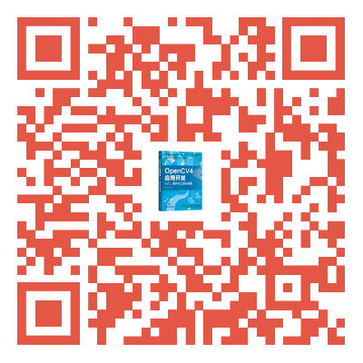

# MyOpenCV4Book

#### 介绍
```
图书《OpenCV应用开发：入门、进阶与工程化实践》的代码与资料下载
欢迎关注我的个人微信公众号：OpenCV学堂
```
扫码购买本书
https://item.jd.com/10092255924058.html



图书的代码基于:
- OpenCV4.8
- VS2015/VS2017
- python版本3.8.5
- OpenVINO版本2023.1

#### B站视频学习
我录制了30课时的OPenCV4 C++版本的免费视频，在B站
提供给大家免费学习，需要直接点击下面地址即可
OpenCV4.x  C++快速入门视频教程
https://www.bilibili.com/video/BV1i54y1m7tw

更多视频教程搜索B站【OpenCV学堂】

### OpenCV实验大师平台
OpenCV实验大师平台一款OpenCV工程化开发效率提升与OpenCV教学质量提升的专业工具软件。作者花了400多个日日夜夜开发的软件，全免费给所有OpenCV开发者与爱好者使用。当前支持功能包含：
- 涵盖机器视觉常用的图像处理、分析、测量等技术要点
- 支持ONNX格式模型推理演示
- OpenCV算法流程设计所见即所得
- 支持插件模式，充分调动学生动手能力
- 支持一键导出算法流程PDF文件
- 提供超过20个OpenCV案例项目文件
- OpenCV推理演示涵盖图像分类、对象检测、语义分割
- 深度学习对象检测与语义分割数据标注支持
- 支持Win10/Win11/Ubuntu下安装与使用

查看安装指南：https://mp.weixin.qq.com/s/a9ZyGHYadN61_Cz8n0bImg

扫码下载安装包


## 联系方式
QQ:57558865 注明：opencv即可

邮件:57558865@qq.com

微信：bfnh2qxx 注明 合作

<b>非技术合作请勿加微信</b>

B站课程主页：https://space.bilibili.com/365916694

OpenCV学堂高品质课程主页：https://appetjpz4tj8166.h5.xiaoeknow.com/


### OpenCV学堂 微信公众号

